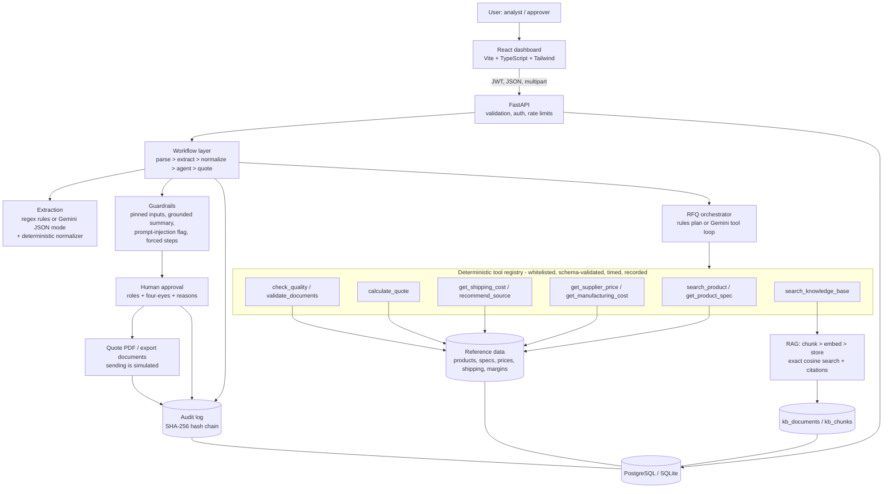

# Architecture

## Request flow for an RFQ
1. `POST /api/rfq` validates the file (extension allow-list, magic bytes, 5 MB cap), stores it under the run id, writes the
   first audit entry and returns `202` with a run id. Processing continues in a background job.
2. **Parse** (pypdf / text) -> **extract** raw literal fields (regex rules, or Gemini with a JSON schema) -> **normalize**
   in code: units to kg, dates, port aliases, product resolution. The model never converts units or dates.
3. **Agent** receives only the validated fields. Rules mode runs a fixed tool plan. LLM mode lets Gemini choose tools, but
   validated arguments are *pinned* (overwritten if the model changes them; each override is logged).
4. `calculate_quote` is the only producer of a price. The workflow forces the missing steps if the model skips it.
5. A `Quote` row is stored as `pending_approval` (or `needs_info`), with warnings, sources and a summary. The summary is
   rejected in favour of a template if it contains a number that is not in any tool result.
6. An approver decides (four-eyes). Everything above and the decision are in the hash-chained audit log.

## Data model (main tables)
`products, spec_parameters, suppliers, supplier_prices, manufacturing_costs, shipping_rates, margin_rules, historical_quotes`
(reference data, each row has a `source_ref`) · `kb_documents, kb_chunks` (RAG) · `users, workflow_runs, uploaded_files,
extractions, tool_calls, quotes, approvals, coa_checks, export_documents, consistency_findings, audit_log, eval_runs`.

## Why no pgvector
pgvector is not installable in the build sandbox and is unnecessary at this scale (~235 chunks). Embeddings are stored as
JSON and searched with exact cosine similarity in NumPy behind one function (`rag/store.py: search`). Swapping that function for
a pgvector query is the intended upgrade path.
